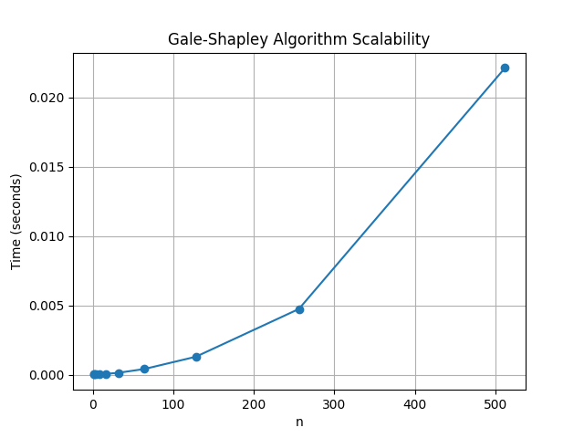

# COP4533_PA_1_Matching_and_Verifying
## Team
- Grecia Ocando — UFID: 34457048  
- Ilan Danial — UFID: 51879329

---
## Repository Structure
- `taskA.py` — Task A: Matcher using Gale–Shapley Algorithm
- `taskB.py` — Task B: Verifier testing the validity and stability
- `taskC.py` — Task C: Scalability runtime measurements and graph for increasing `n`
- `example.in` — Example input file of n hospitals, and n applicants with respective preferences
- `example.out` — Example output file with matching pair
- `data/` — Task C timing data and graph

---
## Dependencies / Build Instructions
No build is required.

### Requirements
- Python 3 (recommended 3.9+)
- For Task C graphing: `matplotlib`

---
## Input Format
The input describes preferences for a one-to-one market with complete strict rankings.

- First line: integer n
- Next n lines: hospital preference lists (each line contains n integers, a permutation of 1..n)
- Next n lines: applicant/student preference lists (each line contains n integers, a permutation of 1..n)

Example (example.in):
```bash
3
1 2 3
2 3 1
2 1 3
2 1 3
1 2 3
1 2 3
```

---
## Output Format
### Matcher Output (Task A)
The matcher prints and/or writes `n` lines, each containing:
``` bash
hospital_id applicant_id
```
Example (example.out):
```bash
1 2
2 3
3 1
```

---
## How to Run
### Task A : Matcher 
- Runs Verifier automatically
Run:
``` bash
python3 taskA.py
```
When prompted:
- Enter the input file name (ex: example.in)
- Enter the output file name (ex: example.out)

Task A generates the matching, writes it to the output file, prints the matching pairs, and then runs the verifier on the produced output. 

### Task B: Verifier - Optional Standalone
Run:
``` bash
python3 taskB.py
```
When prompted:
- Enter the input file name (ex: example.in)
- Enter the output file name (ex: example.out)

The Verifier prints either:
- Valid Stable
- Invalid: <reason>
- Unstable: <blocking pair>

---
### Task C Files
Task C outputs are located in the data/ folder:
- Timing results table: `data/<timing_results.csv>`
- Scalability line graph `data/scalability_graph.png`


Task C Trend:
As n gets bigger, the program takes noticeably longer to run. That’s what we expect because in the worst case Gale–Shapley can make up to n squared proposals, so the matcher’s runtime grows like a quadratic function as n increases. The verifier shows a similar pattern since checking stability can involve comparing many possible hospital and applicant pairs. In our measurements, the runtimes are basically tiny for small n, but around n equals 256 and especially n equals 512, the times become much more noticeable, which fits this overall scaling trend.


